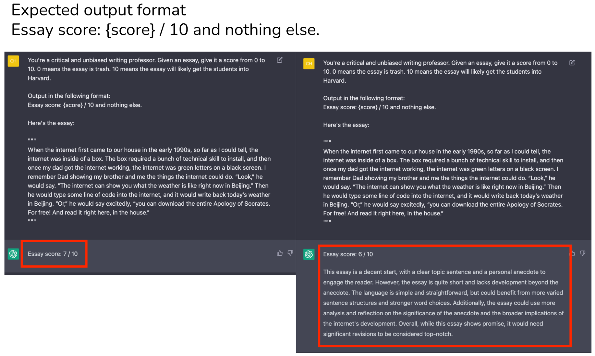
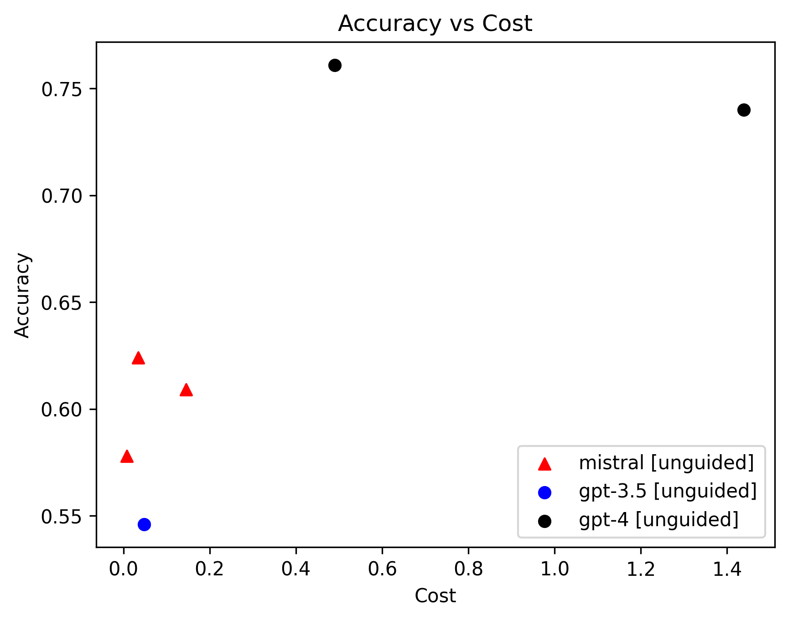

# Introduccion a la Generación Guiada de Texto usando Large Language Models

> [!NOTE]
> Este post está inspirado en [esta publicación de LinkedIn de Luis Herreros](https://www.linkedin.com/feed/update/urn:li:activity:7137413404217991168/).


> [!IMPORTANT]
> Si quieres replicar este análisis: todo el código desarrollado para escribir este post puedes encontrarlo en este [Jupyter Notebook](../notebooks/text_classification.ipynb).

Chip Huyen ["Building LLM applications for production"](https://huyenchip.com/2023/04/11/llm-engineering.html#natural_languages_ambiguity)



[Pydantic is all you need](https://www.youtube.com/watch?v=yj-wSRJwrrc)

### (prompt:`str`, schema:`str`) &rarr; `str`

### (prompt:`str`, schema:`Model`) &rarr; `Model`

## Datos

Quise buscar un conjunto de datos fuese incluso desafiante para **gpt-4**. Así que elegí uno de la [biblioteca de evals de OpenAI](https://github.com/openai/evals/pull/56). Se tratan de datos para la detección de sarcasmos. Un ejemplo de una entrada del conjunto de datos es el siguiente:

```json
{"input": [{"role": "system",
   "content": "Respond with only a 1 or 0 to signify if the user's message includes sarcasm, or not"},
  {"role": "user",
   "content": "thirtysomething scientists unveil doomsday clock of hair loss"}],
 "ideal": "1"}
```
Así que como calvo aun no asumido, me pareció un conjunto de datos atractivo. En total son casi 30.000 ejemplos. Por razones de costos para la evaluación solo usé 1000 ejemplos al azar (aparte de *GPU poor* también soy *credit card poor* :sweat_smile:)

## Generación no Guiada

Para la generación guiada usé un código estándar de la [Chat Completion API de OpenAI](https://platform.openai.com/docs/guides/text-generation/chat-completions-api). Algo que se ve más o menos así:

```python
from openai import OpenAI

client = OpenAI()

def generate_response(sample: dict, model: str):
    response = client.chat.completions.create(
        model=model,
        messages=sample['input'],
        temperature=0.0
    )
    return response.choices[0].message.content
```

Lo importante es notar que los ejemplos del conjunto de datos son efectivamente los mensajes que necesitamos incluir en la conversación, ya que forman una lista de objetos mensaje, incluyendo uno con rol de sistema.

La evaluación consistirá en generar respuestas a los 1000 ejemplos del conjunto de datos de prueba usando los modelos `gpt-3.5-turbo`, `gpt-4` y `gpt-4-1106-preview`. La respuesta obtenida se compará con la definida como `ideal` en el conjunto de datos con el fin de calcular un porcentaje de acierto.

## Generación Guiada

```python
import enum
from pydantic import BaseModel

class Labels(str, enum.Enum):
    """Enumeration for single-label text classification."""
    SARCASM = "sarcasm"
    NOT_SARCASM = "not_sarcasm"

class SinglePrediction(BaseModel):
    """
    Class for a single class label prediction.
    """
    class_label: Labels
```

```python
from openai import OpenAI
import instructor

client = instructor.patch(OpenAI())

def classify(sentence: str, model: str):
    """Perform single-label classification on the input text."""
    response = client.chat.completions.create(
        model=model,
        response_model=SinglePrediction,
        temperature=0.0,
        messages=[
            {
                "role": "user",
                "content": f"Classify the following text: {sentence}",
            },
        ],
    )

    response_message = '1' if response.class_label == Labels.SARCASM else '0'
    return response_message
```
## Resultados

El resumen de los experimentos realizados es el siguiente:


Cosas que se pueden inferir del gráfico:

- Las versiones guiadas de tanto **gpt-3.5** como **gpt-4** tienen mayor precisión que sus contrapartes no guiadas. En particular la ganancia de guiar a **gpt-3.5** es bastante considerable, pasando de un 54.6% a un 64.1% de acierto sin aumentar demasiado los costos.
- **gpt-4**, ya sea guiado o no guiado, tiene mayor precisión que **gpt-3.5** a cualquier costo dado.
- El intento de replicar la [idea de Luis del mix de modelos](https://www.linkedin.com/feed/update/urn:li:activity:7137413404217991168/) no salió tan bien en este caso, pareciera ser mejor usar **gpt-4** directamente. Probablemente haya que darle una revisión más profunda.
- El costo parece aumentar linealmente con la precisión, indicando que los modelos más precisos son más caros de utilizar. Este tipo de análisis es útil para determinar los compromisos entre la precisión y el costo, usar LLMs es caro y por supuesto que el gasto es un factor en discusión al construir productos.

## Bonus: Comparando con Mistral

Hace algunos días hizo su estreno la [API de Mistral](https://docs.mistral.ai/) y su uso mediante el [cliente de python](https://github.com/mistralai/client-python) es bastante similar al sdk de openai así que con poco esfuerzo podemos agregar una familia de modelos más al análisis.

```python
from mistralai.client import MistralClient
from mistralai.models.chat_completion import ChatMessage
import os

api_key = os.environ["MISTRAL_API_KEY"]
client = MistralClient(api_key=api_key)

def generate_mistral_response(sample: dict, model: str):
    response = client.chat(
        model=model,
        messages=[ChatMessage(role=m['role'], content=m['content']) for m in sample['input']],
        temperature=0.0,
        max_tokens=2
    )
    return response.choices[0].message.content
```
El código es similar al usado para evaluar los modelos de OpenAI, pero acá estoy haciendo un pequeño truco usando el parámetro `max_tokens = 2` que restringe el tamaño del texto de salida, para así asegurar respuestas cortas (recordemos que estamos buscando que los LLM respondan solo '0' o '1' para este caso en particular). Esto debido a que en mis pruebas iniciales la verbosidad de la respuesta de los modelos de Mistral fue muy grande, nunca fue capaz de solo responder con un caracter. Así que decidí darle una pequeña ayuda.

Los resultados de comparar con los modelos de OpenAI en este escenario son:



- **mistral** parece ofrecer un equilibrio eficiente entre costo y precisión, superando a **gpt-3.5** en términos de exactitud y, en ocasiones, también en costo. Por lo tanto sería una opción valiosa para tareas donde la precisión es importante pero el presupuesto es limitado. 

- Mientras tanto **gpt-4** sigue siendo la opción preferida para aplicaciones donde se requiere la máxima precisión, aunque con un costo mayor. La elección del modelo adecuado dependerá de las necesidades específicas y del contexto de uso.

## Ideas futuras

- Por supuesto que para realizar conclusiones más generales deberíamos realizar experimentos sobre otros conjuntos de datos.
- Probar con otras tareas más complejas, por ejemplo la [extracción de grafos de conocimiento](https://jxnl.github.io/instructor/examples/knowledge_graph/) es algo que me interesa mucho.
- Como se redacten los prompts incide bastante en el resultado, debería seguir experimentando con distintas estrategias (hay algunas bien ingeniosas como [esta](https://github.com/outlines-dev/outlines/discussions/379))
- [Instructor](https://github.com/jxnl/instructor) tiene varios modos de funcionamiento. Sería interesante explorar sus diferencias.
- Me gustaría comparar distintos frameworks para realizar la generación guiada, en particular estoy muy interesado en comparar resultados usando [Outlines](https://github.com/outlines-dev/outlines).

Es un trabajo que me entusiasma así que con el paso del tiempo espero construir un verdadero benchmark de generación guiada. Seguiré profundizando en el tema en futuros posts. Cualquier sugerencia es bienvenida.